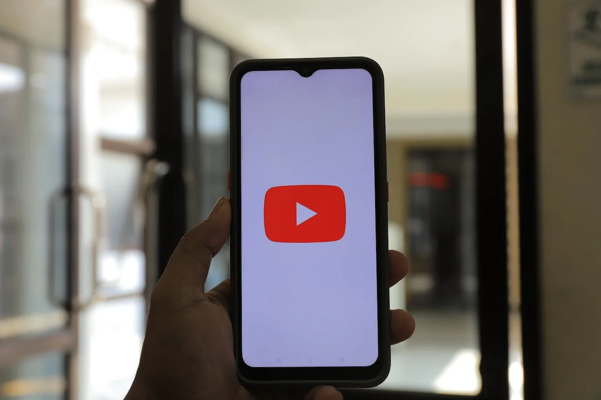

## Introduction:

In the dynamic world of content creation, platforms like YouTube have played a pivotal role in connecting creators with their audiences. As someone who embarked on a YouTube journey in 2020, I experienced the highs and lows of content creation. However, after three years of dedication, I found myself at a crossroads, leading me to make the tough decision to step away from the platform. In this post, I'll delve into the three primary reasons that prompted me to bid farewell to YouTube and explore an alternative path that aligns better with my goals.

## Reason 1: Landscape has changed
The onset of the COVID-19 pandemic saw a surge in content creation as people sought new ways to spend their time. The demand for content was high, but by 2023, the landscape had transformed significantly. Educational content creators faced a daunting challenge of standing out amidst the crowd pullers like news, comics, and film-related content. Unfortunately, educational content struggled to capture the audience's attention, making it increasingly challenging for solo creators to thrive.

## Reason 2: Posted content does not get promoted
While YouTube serves as a vast platform with immense potential, getting content noticed became an uphill battle. The algorithmic changes and sheer volume of content meant that creators had to rely on their existing subscriber base or invest in promotional efforts. For those starting from scratch, breaking through the noise proved to be as challenging as finding a needle in a haystack. The lack of organic promotion made it difficult for new creators without a substantial audience to showcase their work.

## Reason 3: Form over content
The evolution of content creation standards brought forth new challenges. The days when a front camera sufficed for creating engaging content are long gone. Today, success demands high-quality cameras, aesthetically pleasing backgrounds, captivating thumbnail graphics, and more. The time-consuming process of adhering to these visual standards often took away from the core focus – the content itself. This shift towards a more polished presentation, while visually appealing, did not necessarily translate into increased viewership.

## Alternative
In light of these challenges, I've decided to retreat from YouTube content creation and refocus my efforts on traditional blogging. Leveraging the power of AI tools, my blogging endeavors have seen a resurgence. The efficiency and effectiveness of these tools have allowed me to rediscover the joy of content creation without the constraints and challenges posed by the ever-evolving landscape of YouTube.

## Conclusion:

The decision to step away from YouTube was not made lightly, and it's essential for content creators to regularly reassess their chosen platforms. While YouTube remains a giant in the industry, the shifting landscape and challenges faced by solo creators necessitate adaptability. For those seeking a more flexible and personally fulfilling creative outlet, exploring alternative mediums, like traditional blogging with AI enhancements, might prove to be the key to sustained success and satisfaction.