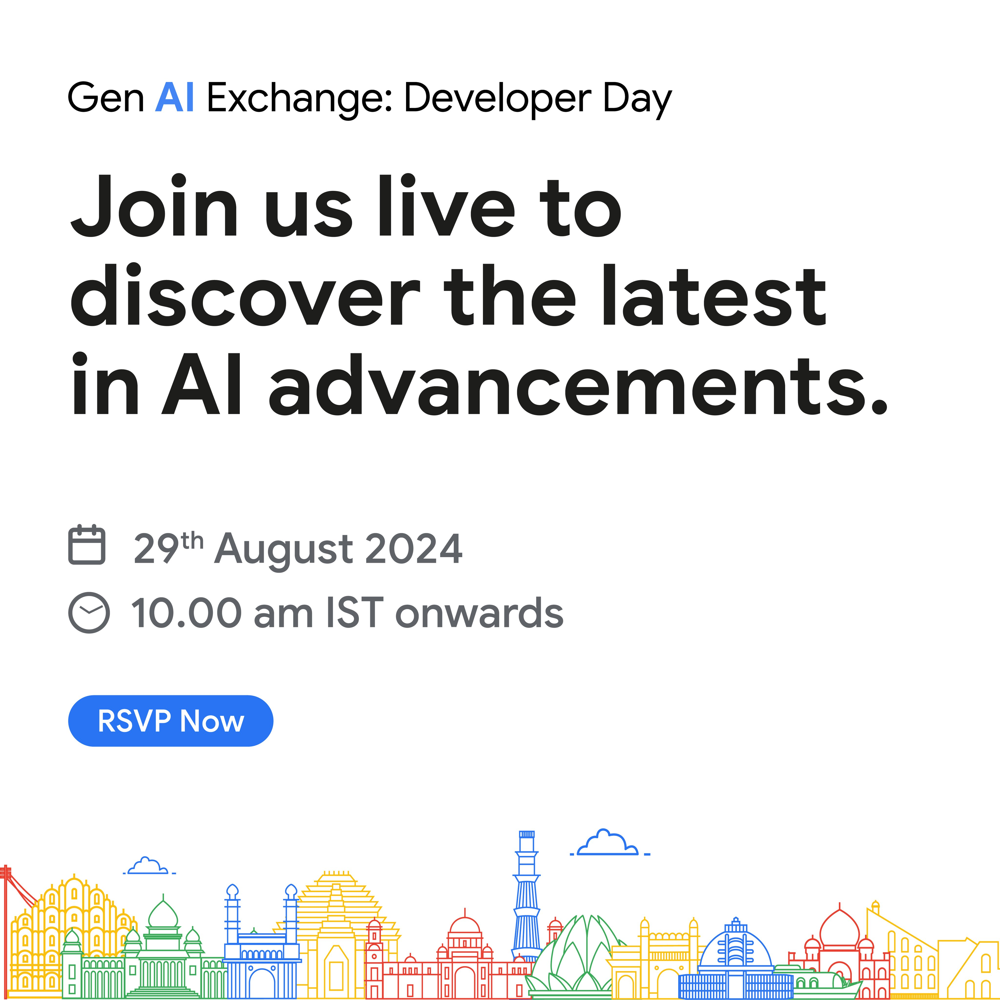

<head>
  <meta charSet="utf-8" />
  <meta property="og:title" content="Google GenAI Developer Day Bangalore 2024 Learnings" />
  <meta property="og:image" content="/img/2024/genai-dev-day.jpeg" />
  <meta property="og:url" content="http://dhbalaji.dev/blog/2024/google-genai-exchange-developer-day-2024-good-parts" />
  <meta property="og:description" content=" This concise blog post highlights the React Nexus 2024's best aspects, helping you recap the big ideas that were discussed!" />
  <meta property="og:type " content="article" />
  <meta name="twitter:title" content="This concise blog post highlights the Google GenAI Developer Day Bangalore 2024 Learnings, helping you recap the big ideas that were discussed!" />
  <meta name="twitter:image" content="/img/2024/genai-dev-day.jpeg" />
  <meta name="twitter:description" content="This concise blog post highlights the Google GenAI Developer Day Bangalore 2024 Learnings, helping you recap the big ideas that were discussed!" />
</head>

This blog post summarizes key takeaways from the Google GenAI Developer Day in Bangalore, focusing on technical aspects relevant to  developers.

### 1. GenAI Impact and Demand

While "AI" is often misused in marketing, the conference solidified the transformative power of Generative AI (GenAI) across personal, professional, and societal applications.  For businesses, GenAI tools enhance developer productivity by:

* **Auto-completion:** Generating code snippets based on prompts.
* **Context-aware Test Generation:** Automatically creating test cases.
* **Code Explanation and Review:** Providing explanations and assisting with code reviews.
* **Multilingual Support:** Supporting various programming languages and transpiling between them.
* **Full Codebase Awareness:** Enriching analysis, refactoring, and optimization.
* **Efficient Code Generation:** Capable of generating substantial code volumes (e.g., 100k lines)  from single prompts.

### 2. Code Enhancement Use Cases

Live demonstrations showcased GenAI's capabilities. Notably, the creation of a shopping cart app with star ratings on both frontend and backend required only a few prompts. 

**VS Gemini vs. Code Assist Addon**

While both tools generate code, Gemini offers a key advantage: it can learn and generate code for new or less common libraries on-the-fly, surpassing limitations of pre-trained languages.

### 3. Integration with Popular Code Repositories

Google Code Assist seamlessly integrates with Github, GitLab, and Bitbucket, generating code for diverse use cases.  For enterprise security, models are trained on single-tenant private clouds, garnering trust from financial institutions.

**Developer Tools and Resources**

* **Vertex AI and Natural Language Integration:** Enables log and crash analysis using natural language queries within GCP.
* **Code Assist Availability:** Extends to various IDEs like Android Studio, GCP, and databases.
* **AI Practice Platforms:** Google Colab for experimentation and Google Codelabs offering industry-leading examples.
* **GenAI Database Support:** AlloyDB delivers high-performance, fully-managed database capabilities specifically suited for GenAI. Similar capabilities were showcased by MongoDB, Neo4j, and Elasticsearch.
* **Vertex AI Multimodal Exploration:** Explore GenAI functionalities for various modalities within GCP via "Goto Vertex AI > Multimodal > Ask Prompt".
* **Google Cloud Functions Update:** Google Cloud Functions are now rebranded as Google Cloud Run.

### 4. Foundational Concepts for GenAI Development

Developing GenAI applications requires:

* **Training Data:** To build robust models.
* **Context-Aware Responses:** To generate relevant outputs based on natural language prompts.
* **Unified Data Handling:** Images, videos, and text are treated as equally compatible data sources.

### 5. Retrieval-Augmented Generation (RAG)

While details weren't extensively covered, the session briefly introduced RAG as a technique for enhancing GenAI models. 

### 6. Hackathon

The concluding session featured a hackathon based on the [Codelabs](https://codelabs.developers.google.com/patent-search-alloydb-gemini?hl=en#0).

## Links

- Session Recording on Youtube - https://www.youtube.com/live/DqRHWq1IGgs
- Codelabs - https://codelabs.developers.google.com/patent-search-alloydb-gemini?hl=en#0
- Related courses - https://www.cloudskillsboost.google/paths/118
- Google cloud India - https://twitter.com/GoogleCloud_IN
- Webinars - https://cloudonair.withgoogle.com/