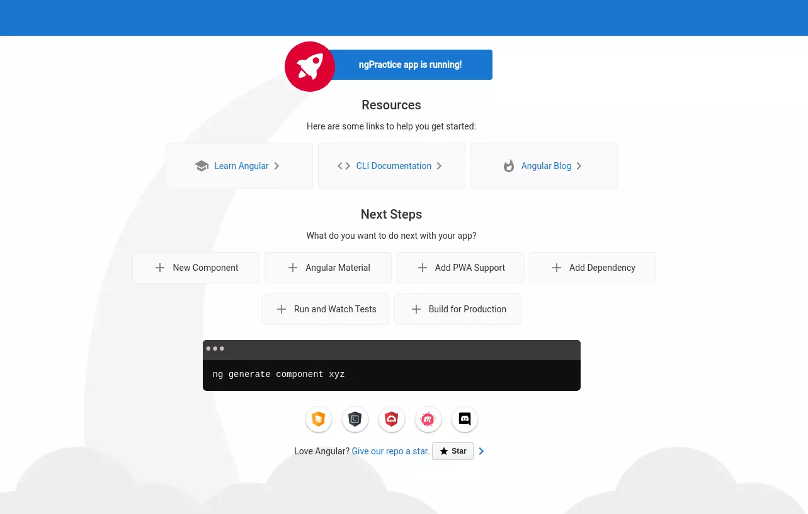

After many years, I decided to keep up with the developments at Angular. The dev setup was to run angular CLI but it won't work. Let's find out why

<!-- truncate -->
 
## What is your current setup?

Currently running the 20.10 version of ubuntu mate. The nodeJS was downloaded from the snap store and yarn from the apt-get.

For writing code I use Webstorm

## What were the issues and the fixes

Creating a basic app would not happen automatically with CLI. The CLI app would crash.

The cli had issues accessing the node from the snap location so I decided to uninstall the snap version of nodeJS and install it from the apt package manager.

The apt package manager would not install npm along with nodeJS so I had to install npm separately.

The Angular CLI would not work because the yarn was selected as a package installer. The yarn was installed through apt but I guess it was the wrong yarn version of yarn itself. I had to uninstall the yarn through apt remove.

The yarn was installed through npm globally.

At last, I was able to create an ng-app from CLI. The app asks you a couple of questions like whether to include the router, which type of CSS you want to support etc which is cool.

The starting page in localhost is quite meaningful. It gives you links for cli documentation, learn angular, etc.

The hello world which was supposed to take few minutes on my localhost took nearly an hour.

## Final thoughts

- If beginners are using Linux, then get familiar with permission related errors and how to fix that

- If you are using sudo as a trial and error command, then get away from that habit

- Few things on Linux are not straightforward, you got to know how to solve the issues.

## How to prevent this issue from reoccurring

Keeping up with versions and development workflow changes can be daunting. There is a whole team of developers working to improve things and integrating the improvements to your knowledge and workflow is risky too.

I request your team to maintain a stable scaffold that you can check out even in the middle of the night or in tough times like interviews and get the work done. 

Imagine sitting in a interview and troubleshooting the Angular or react CLI related issues is not a good idea.
