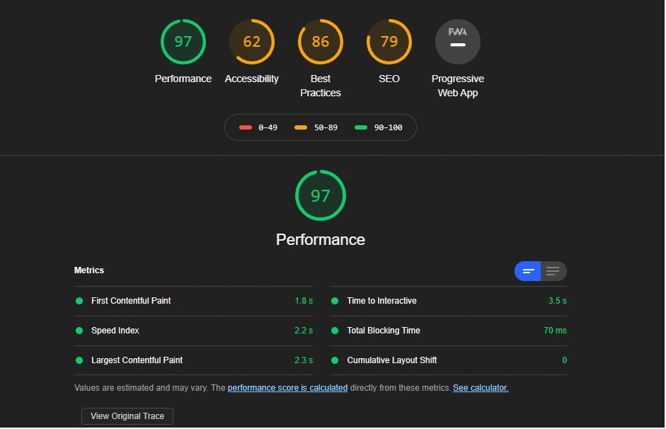

## Introduction to Google Chrome Lighthouse

> Version being discussed here -- Lighthouse 6.2.0

* [Lighthouse](https://developers.google.com/web/tools/lighthouse) is an automation tool to audit the quality of web pages.

* Lighthouse can help you monitor a bunch of metrics on mobile & desktop-like
    * Performance
    * Accessibility
    * Best practices
    * SEO
    * PWA etc
    
* Lighthouse is to be baked into the tooling pipeline so that your app quality is monitored on a regular basis.

* There are 2 variants of Lighthouse. One is the web version & other is the nodeJS version which we can use to conveniently integrate to the tooling.

## Understanding Lighthouse as a system

**Purpose** - Audit web pages in the tooling stage

**Input** - The web page

**Output** - Report in JSON

**Configuration** - Configurable in terms of what parameters to measure

**Extensible** - with plugins

**Analysing output** - can be ingested to program through JSON or human-readable with 

[lighthouse viewer](https://googlechrome.github.io/lighthouse/viewer/).

**Programming language** - NodeJS & GUI in the browser

## Performing light house audit

Let us start with the web version of the lighthouse which does not involve any coding. Just open dev tools on chrome and goto the audits tab. Tick the metrics and the platform you are interested in conducting an audit. Once selected, perform an audit.

I performed an audit on the mobile platform and the report is as follows.

 
 

 
 <a href="/downloads/dhbalajidevmobileInitReport.json" download="initialReport.json">Download the JSON report</a>
 
 
 ## Performance issues that are easiest to fix
 
 ### Issue 1: Ensure text remains visible during Webfont load
 
 Most professional websites do not use the native fonts, the same with my blog too. The hexo theme uses `font-awesome` which needs to be downloaded before the text could be shown. This is a **performance issue**.
 
 This can be solved by adding `font-display: swap` in the @font-face CSS declaration.
 
 More information can be found on [web.dev](https://web.dev/font-display/). There is a problem with this fix. There is a chance of another issue which is termed `Flash of Unstyled Text`. This calls for a regression issue. The fix for the flash of unstyled text (FOUT) is to `preload` the fonts so that the render is not delayed by the critical request chain.
 
 <pre>
    <link rel="preload" href="/css/fonts/fontawesome-webfont.woff" as="font" type="font/woff" crossorigin/>
 </pre>

The browser will preload the page and will make use of the preloaded fonts when called for in the `@font-face URL`. When preloaded assets are not used, you will notice a warning in the console.

Couple of things to note here

1. The `crossorigin` is a necessary attribute though it looks like you are calling your asset from your website.

2. The URL should be an exact match, for instance, you can refer the asset through multiple ways but you have to use the same path in both ways.

To be continued... 
 
