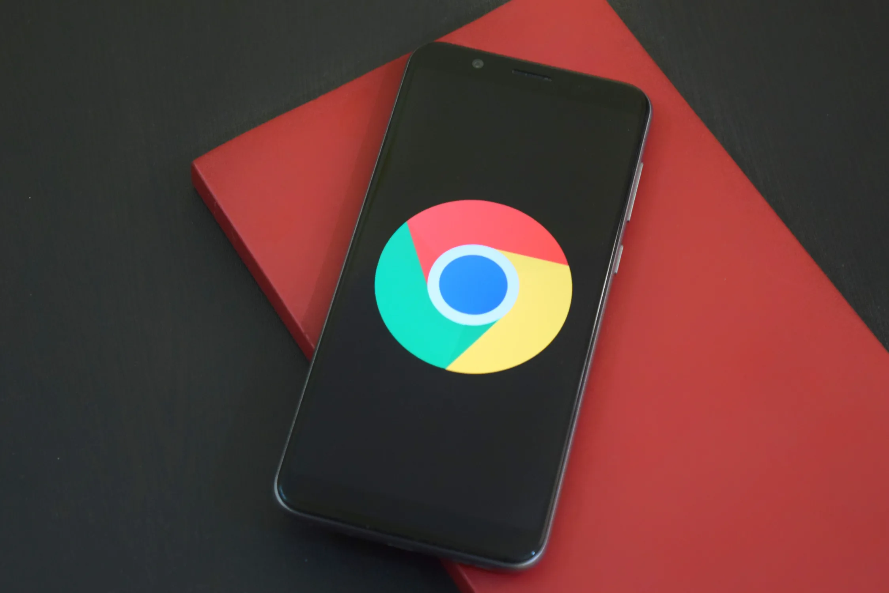

"Which browsers do you support" is a lame question when it comes to frontend development. We have techniques like progressive enhancement & graceful degradation which ensures that the application behaves consistently on different browsers. The browser game has changed, Chrome browser has around 70% share in the browser market by users. Should we still support all the browsers?
<!-- truncate  -->

## Legacy Development Practices

* List down the browsers that you would like to support.

* Come up with a test plan & prioritize the defects. The modern browsers are tested first and the defects are given higher priority. The cosmetic defects on legacy browsers like IE are treated as low priority and deferred until everything breaks.

* There was a banner or message to users about recommended browsers for a particular application. For example, this site works best on chrome.

## Moving into the post-IE era

Microsoft decides to take down IE in 2020. The Microsoft browser family continues to run in the name of [Edge](https://docs.microsoft.com/en-us/microsoft-edge/deploy/about-microsoft-edge) which continues to gain popularity as it works like Chrome. It works like chrome because it's built on top of chromium. Looks like Microsoft does not want to reinvent the wheel like the way they did for Microsoft mobile OS and mobile devices.

### Data privacy which held back chrome is a solved issue

Many enterprises were skeptical about browsers like Firefox and Chrome because of unclear data policies. What if employee data falls into wrong hands. This is a solved issue because the Chrome browser gets packaged for enterprises and can be managed by the enterprise admin. They can choose which extensions can be used by employees etc. Ultimately there is no need for IE or another browser from Microsoft because they do not have a USP now.

More about [chrome enterprise browser](https://chromeenterprise.google/browser/download/)

## How the future might look after the chrome browser monopoly

1. The life of the developer remains the same, we still have to use polyfills, etc as we cannot guarantee what the remaining 30% of users are using.

2. Throwing in-browser messages about "Works on Chrome" is not good user experience. We still need to cater to enterprise or OS browsers like Edge, Safari, Samsung internet browser, etc.

3. Apps are gonna be unpredictable based on custom browser modes like

    a. Data saver mode
    
    b. Block trackers and ads mode
    
    c. Lite mode of parent browsers like Firefox lite
    
    d. Functionality limiting browser extensions
    
4. Browser APIs help us do a lot more from web apps like battery API, sensor API, etc.

5. Extensions are for niches like developers, shoppers etc. Mainstream apps were taken away from chrome after API got deprecated.

6. QA still needs to have a test plan for other OS browsers like Edge, Safari, and Samsung internet browser. Deferring testing on OS browsers could lead to angry customers who would not install the Chrome browser.

7. Business analysts need to pay attention to a variety of browsers and need to put in some thought during requirements gathering.

8. Service workers and PWA helps developers to build apps for other platforms which work like natively installed apps. I found them saving my time to install and start using. Apart from that, they work like any other app.

## Closing notes

There may not be a browser war right away. If it happens it could be related to data sharing and tracking issues among the users. Businesses and bloggers like me should consider a minimum set of browsers like listed below.

    Desktop Platform
    
    1. Google Chrome family of browsers
    2. OS browsers like Edge & Safari
    3. Firefox
    
    Tablet Platform
    
    1. Safari on IOS
    2. Chrome browser
    3. Chromium
    
    Mobile Platform
    
    1. Google Chrome browser
    2. OS browsers like Safari
    3. Others depending on the region of the customers like UC browsers in APAC region.

This is exactly the same list of browsers against which this [blog](https://dhbalaji.dev/) gets tested against.
