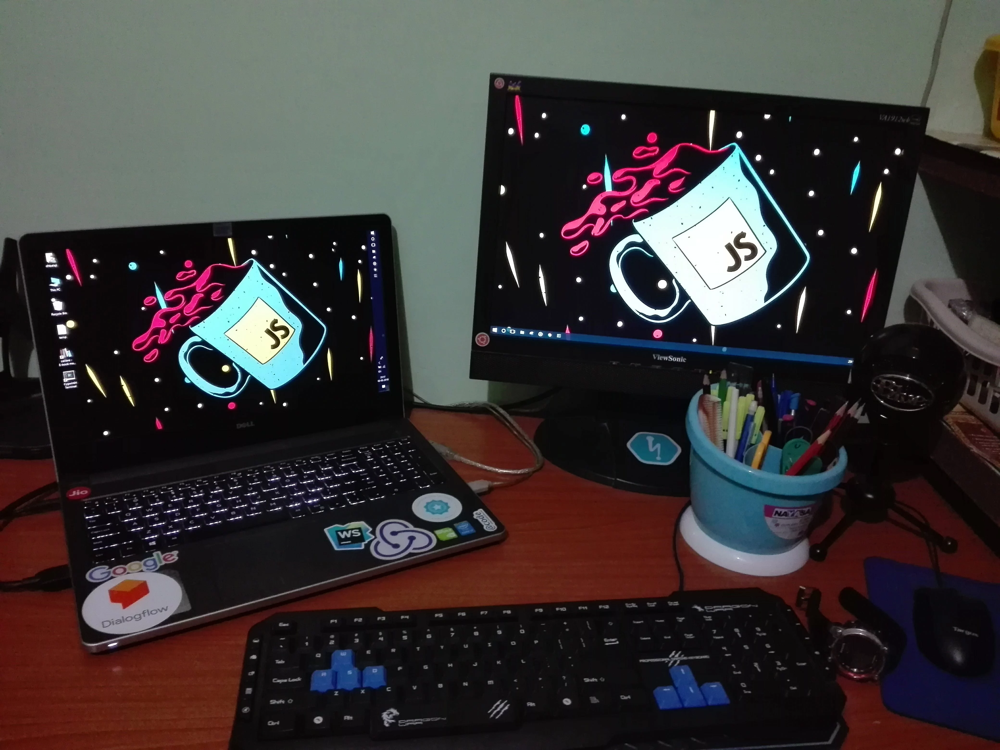

I made my first full week trip without carrying my laptop. Yikes, it's unusual for a nerd like me who has never done that. Let me tell me how I offloaded the work from my laptop. Now be it work or personal, I can get it done in a single workstation.

 
 
## What were you using your laptop 5 years ago?

The personal laptop was a necessity back then because I was in service firms that had to comply with industrial era information security rules. The rules like whitelisting URLs, blocking permissions to install packages are strict. 

> Disk encryption, block USBs are my favorite information security rule at workplaces.

My requirements were almost the same as now

1. Built fun stuff for learning libraries
2. Install fun tools
3. Push to GitHub
4. Blogging
5. Online shopping
6. Manage movies and music collection
7. Organize ebooks

I remember breaking things when I was working with the WAMP stack, some ports used by other projects would be overwritten. 

## What do you use your laptop for in 2021?

Some requirements have changed and few are no more valid. 

1. Built fun stuff for learning libraries _with nodeJS_
2. Install ~~fun tools~~ npm packages and use the same IDE
3. Push to ~~github~~ git vendors
4. Blogging _and maintaining open source_
5. ~~Online shopping~~
6. ~~Manage movies and music collection~~
7. ~~Organize ebooks~~

Thanks to online penetration and faster speeds, managing music, ebooks are a thing of the past.

> Mobile phones have offloaded content consumption work from the laptops, what is left would be content generation and UX.

## Merging workflows into a single machine as a developer

### Tasks I succeeded at

- Git aliases for GitHub and bitbucket. I can blog from a single laptop.
- Create profiles in chrome to use Gmail for work and another one.
- Create folder structure in such a way the work and personal files are not in the same place. It comes in handy when you are screen sharing and your family photos show up.
- A sleek business casual wallpaper that appeals to your taste, and it's not going to make it notorious while screen sharing.

### Tasks I won't merge with my official workstation

- Photos from cameras won't meet my official laptop.
- Movie collection, music collection, etc will not be on the official hard drive
- Social media used to be kept at a bare minimum
- Keep caution while downloading digital content
- Won't spin up media center software etc

## Can you let go of your laptop completely?

Not, it will remain. But I might not upgrade my laptop. Maybe I shall upgrade my mobile device with better storage or buy accessories to make it more capable of handling workflows.

Can I read the SD card from my mobile device? Why not, read more about Samsung DeX Desktop Experiences. DeX software compatibility is an issue as the supported devices are quite a few.

There are a few accessories that can be used in the meantime. Like the Baseus Samsung Docking Station.

> The accessories and other fancy mobile accessories may not give good value for money especially if you are used to working with the laptop.