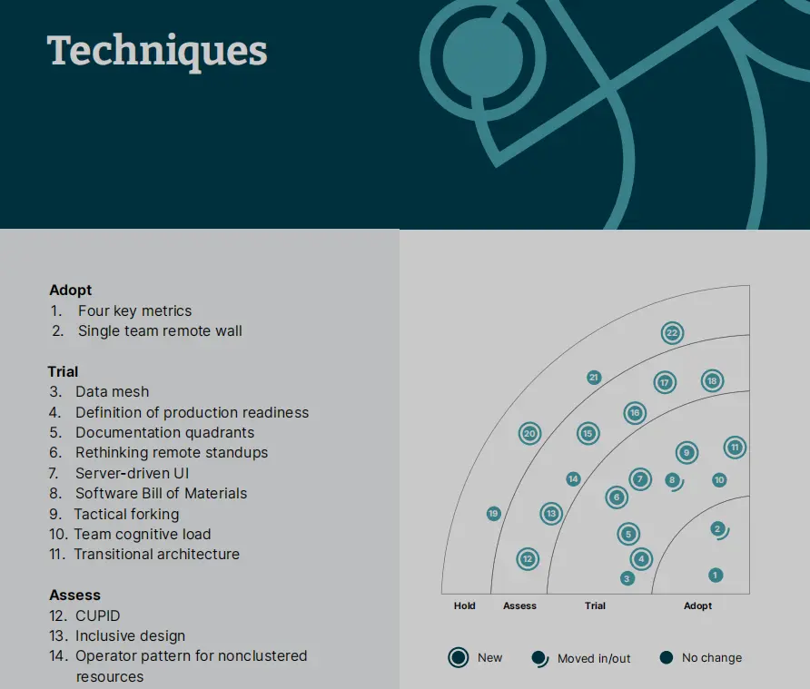

Thoughtworks tech radar is a reputed tech journal available free of cost for subscribers. The content is related to 4 broad categories related to software development. The candidates/techniques are further categorized for easy judgment and use. Here are my notes from episode #26 of tech radar.

<!-- truncate -->
 
## Techniques

I am mostly listing to adopt or hold tools that make sense for mid-size web teams. 

## 1. Four key metrics for high-performance software delivery

- Change lead time, this is the time taken for a team to deliver the change to production
- Deployment frequency, how frequently the changes are deployed 
- Mean time to release (MTTR), how long does the team take to restore an outage
- Change fail percentage, does deploying changes introduce regression issues & what percentage of deployments create a failure or degrade in performance.

The above metrics give a qualitative view of our deliveries. 

### Production readiness review (PRR)

PRR is a checklist to empower developers to software release and launch.

- Product release - shipping the software for consumers for use
  - Ownership identification
  - Training / Documentation
  - Process start time
  - Process stop time
- Product launch - letting the world know
- Product testing results
  - showstoppers - entire product is affected
  - high priority - workflow blocked but no workaround
  - mid-priority - workflow blocked but has a workaround
  - low priority - minor irritations / cosmetic problems
- Code freeze
- Documentation
- Going live with your product
  - product launch plan
  - product launch goals
- Disaster recovery
  - CI - build, tests
  - CD - deploy to production

    
### Documentation quadrants

Technical documentation can be daunting for writers and consumers. But how about giving it an architecture?

https://documentation.divio.com/

The simplest architecture looks like this 

Axis 1: nature of information, practical or theoretical

Axis 2: where the artifact is used, studied, and working

This is an important topic given that the world is witnessing a steady inflow of software tools and software libs. How about each of them having a good documentation architecture? It would be a great win for Developer Experience (DX).

### CUPID, similar to SOLID

Composable, Unix-like (Does one thing very well), Predictable, Idiomatic, and Domain-based solution.

### Techniques about frontend that were discussed

- SPA by default
- Hotwire - send HTML instead of JSON over the wire
- Server-driven UI for mobile
- Micro frontends