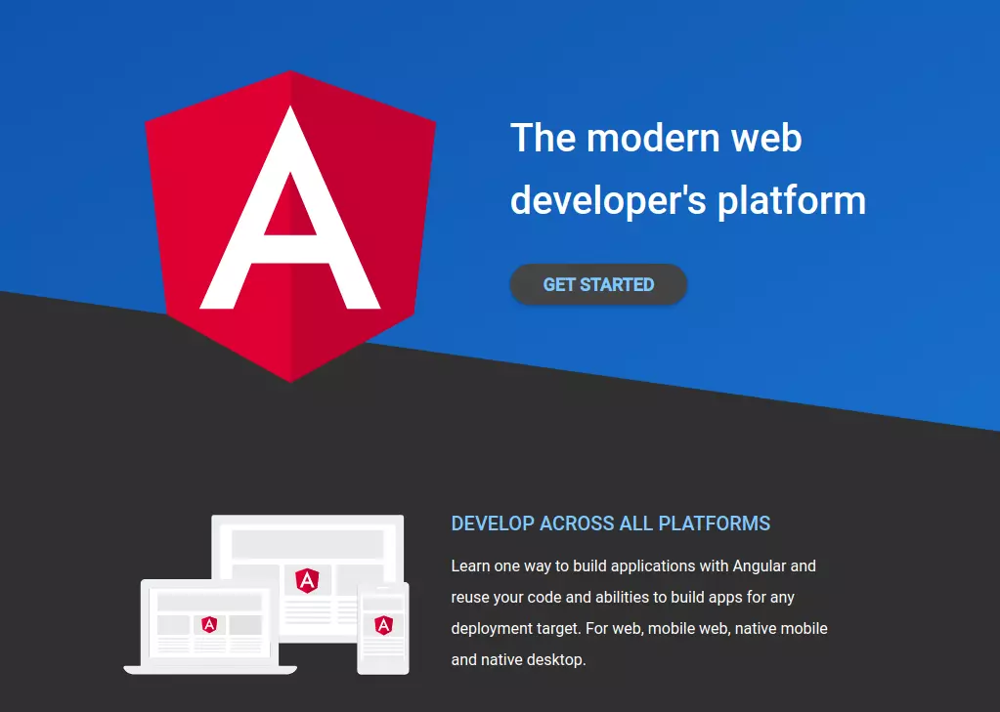

The frontend tech hiring process is not new to me but I still struggle to find the right angular developer. If the technology is a simple one like bootstrap, JQuery then the process is simple. But the Angular being a framework, it been a different game to be a part of the tech hiring panel

<!-- truncate -->

## The difference between React and Angular hiring

Getting a high-quality React professional is easier because of the higher number of professionals working with React than Angular. The react devs looking for a job are higher than angular in 2021. I believe there is a 10:1 ratio of React to Angular developers out there.

Most of the new projects get started with VueJS or Svelte directly leaving behind react and angular in 2021. The number of companies preferring Angular is lesser than React in 2021.

## Hiring process

- Starts with screening resume

- Interview over phone

- Coding round

- Tech discussion

- Finishing the hire

- or Hacker earth route where one problem decides it all

In the hiring process, I get around 1.30 hours to identify the candidate's strengths across a variety of concepts that he/she shall be using every day.

## Why angular devs score low in interviews

The basic expectation is that the developer has a good understanding of Javascript because they work with the frontend. But it's not the case with Angular developers because they work with Typescript. It's very rare for Angular developers to have a good understanding of Javascript concepts.

Let's start with typescript. In the coding round, I check for the `types`  concept in typescript. If the candidate uses `any` in place of `union of types` then he gets a `zero` in typescript skills. This candidate has a bigger challenge to prove himself in the other parts of the interview.

Let's move on to components in Angular. It's a simple concept but the component design thinking is better in react devs than in Angular. In Angular, there are too many concepts where developers have awareness but lack mastery is my concern. Thanks to video courses, a lot of interview candidates walk into the interview with no real-world experience or in-depth understanding.

The deal breaker is unit testing. In the real world, business applications are backed with unit test cases. The Angular comes with the unit, integration tests. It's again difficult to see developers using either of them. At least a theoretical understanding will give them an edge but they lack it.

## What can be done about it

Have a strong core team who can mentor react/JS developers to quickly learn and work with Angular. It's really hard to go scouting for a qualified Angular developer. This way we can hire talented folks and cut the cost associated with hiring activity.
