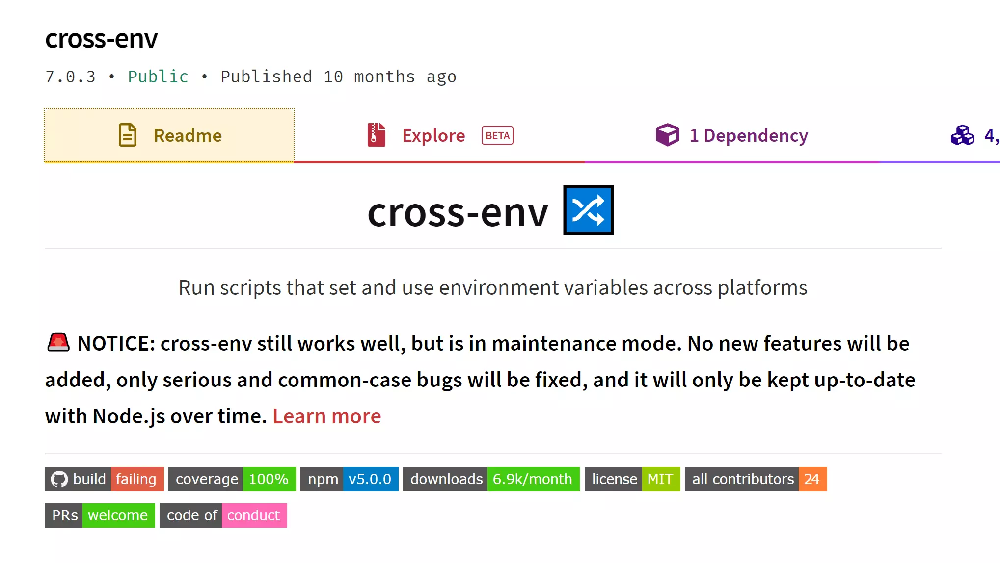
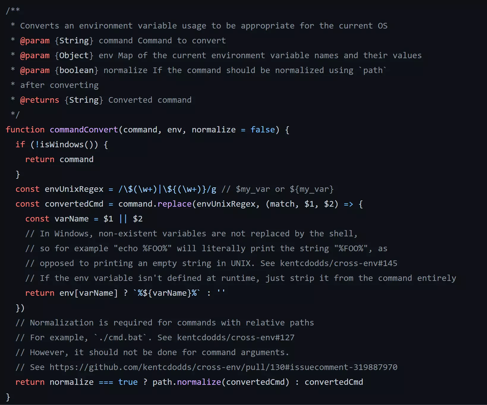
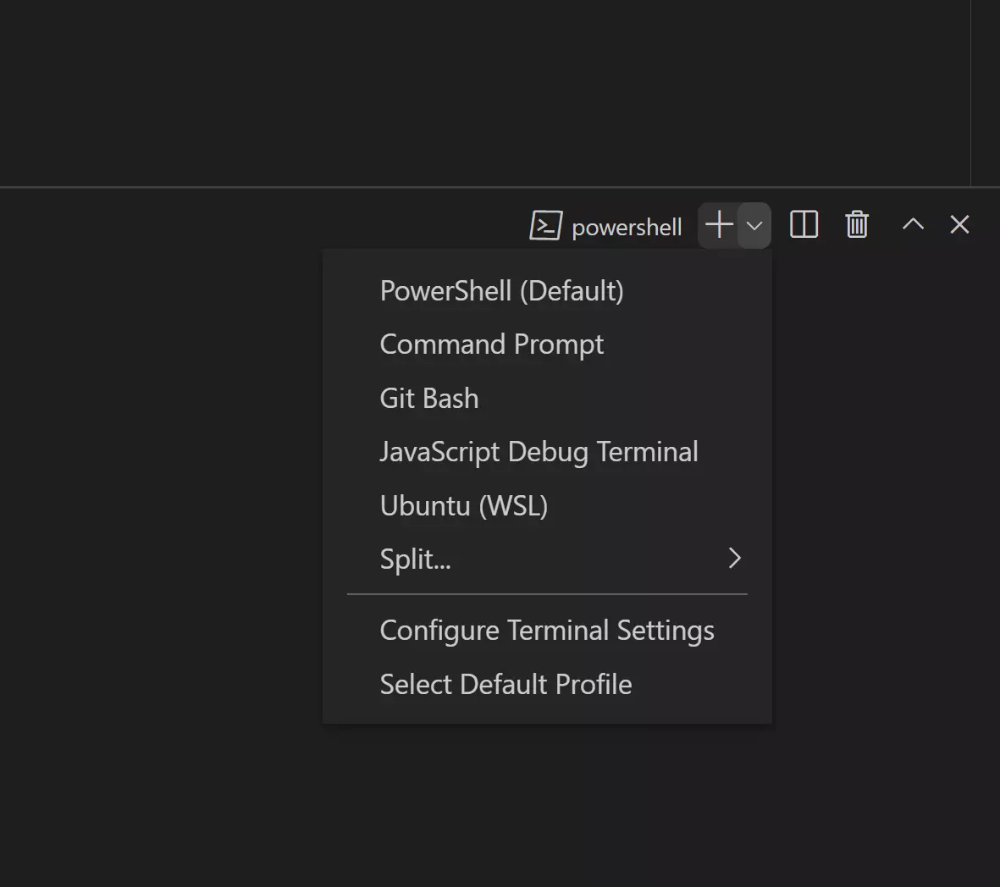

Two Spanish people can converse normally but a Hindi-speaking Indian and a Spanish person need an intermediate guy or a translator. The same with reading and writing variables across different shells. In npm scrips, we read/write environment/shell variables. But there is no uniform syntax to read/write environment/shell variables which causes errors when the npm task is run across different operating systems. We have a `cross-env` package that solves the problem of reading/writing environment/shell variables on different operating systems elegantly.
 
<!-- truncate -->
 
> The difference between environment variables and shell variables is that a shell variable is local to a particular instance of the shell (such as a shell script), while environment variables are "inherited" by any program you start, including another shell

## What is cross-env?

It is a tiny npm package that helps us set and read environment/shell variables across multiple operating systems elegantly. In frontend development, the web assets are generally platform-independent. I mean the web apps work well on all major OS provided they have a browser client installed. The development workflow is vastly based on nodeJS and configurations which need to be set by environment variables or shell variables. The syntax for reading and setting environment/shell variables is dependent on the shell running on the operating system. For instance `git bash` on windows supports Linux-like syntax whereas `cmd` on windows has no clue about that syntax and vice versa.

## Why is `cross-env` required?

To read and write environment/shell variables in npm scripts, we need an operating system independent syntax which is given by `cross-env`.

## How does `cross-env` work?

At the heart of `cross-env` is a nodeJS method that converts the syntax which we used on Windows to match the Linux machine.




## How to set up and use cross-env?

cross-env is added as a dev dependency. 

`npm install --save-dev cross-env`

### To set shell variables

To use `cross-env` we need to call the library from the npm script directly.

`npm start: cross-env BUILD_TYPE=dev ...`

The BUILD_TYPE is available in the nodeJS script that follows under `process.env.BUILD_TYPE`

### To read shell variables declared elsewhere or in the operating system.

Let's say we have an environment/shell variable set elsewhere, then we need to use `cross-env-shell` to read the variable. By elsewhere I meant it's not on the same npm command.

To give a backdrop, on Linux/mac it's `$shellVariable`, and in windows, it's `%shellVariable%`. With `cross-env-shell` we can use a single syntax on both the operating systems.

`build: cross-env-shell npm version $releaseType`

With cross-env-shell, we can also read the environment variables on the host operating system.

## Other features of `cross-env`

Overall `cross-env` is tiny utility with 2 major apis i.e. `cross-env` and `cross-env-shell`. 

We have few more features like passing JSON strings as options to the command which I have not tried. We have options to retain the variable read syntax without replacing it with the actual value with help of backslashes.

## Known issue with `cross-env`




The shell on which the commands are run decides how the commands get executed. On windows, we have a variety of shells like `cmd`, `bash`, `PowerShell, and `wsl` (windows subsystem for Linux). The recommended way on windows is to tell nodeJS to use PowerShell as its default shell which has more capabilities than the cmd shell. 

``` bash
#in .npmrc
script-shell = "C:\\windows\\System32\\WindowsPowerShell\\v1.0\\powershell.exe"

#using the CLI
npm config set script-shell = "C:\\windows\\System32\\WindowsPowerShell\\v1.0\\powershell.exe"

```

## About the author

The author of `cross-env` is [Kent C. Dodds](https://kentcdodds.com/) who is popular in the React community.

The [Github repo](https://github.com/kentcdodds/cross-env) is in archive mode which means no major updates are likely. It makes sense as they have solved the problem which they had in mind so it does not make sense to mindlessly add bells and whistles.

## References

https://www.npmjs.com/package/cross-env
