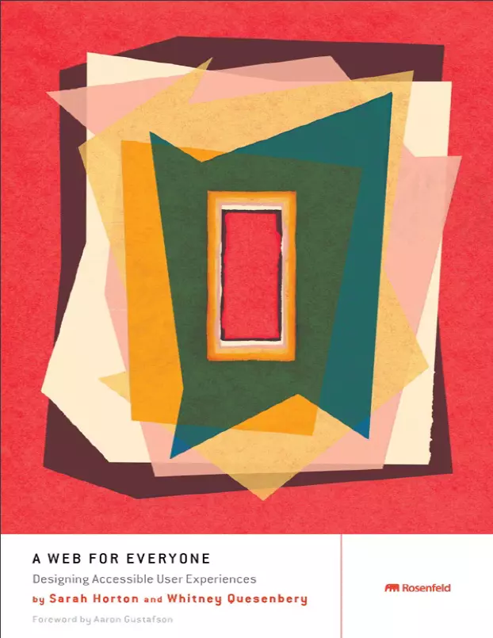

Equality on the web is an interesting and important topic. This is the second book related to accessibility.

## Who should read the book

Books on accessibility relate to design or coding. This book relates to 80% of design and 20% of coding. If you are beginning with accessibility, then this book is the right fit.

## About the author

The author is well exposed to accessibility and the web. Sarah Horton is an expert from whom we want to learn and understand accessibility design.

> [Sarah Horton Website](https://sarahhortondesign.com/)

## Top ideas from the book

1. The personas of the disabled people

Generally, books categorize people with disability and stop there. But the authors take this issue description in a well-recognized technical language called `Personas`. The persona description and images of the users illustrate to the readers about the user. This is important because all our lives we are not exposed to disabled people to a major degree.

2. Equations to simplify ideas

> Ability + Barrier = Disability

The barrier is to be broken with technology. For example, if a user has bad vision then we need to help them consume our content with a screen magnifier or screen reader. Web content should be accessible to the disabled audience

## Verdict

The book is intense literature. As a front-end developer, I could understand the design process and a gentle introduction to WCAG 2.0. This book stands out with personas about disabled people. It helps you to empathize with disabled people.