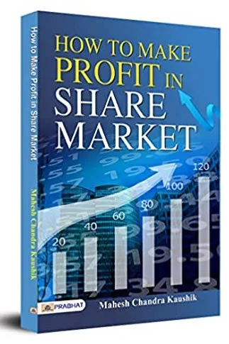

I would like to express my gratitude to Prime Reading for providing access to its exceptional lending library services, which allowed me to explore Mahesh Chandra's insightful book on stock market investing. In recent times, Indian youth have increasingly shown interest in investing, and this book comes as a timely resource to cater to the needs of impatient investors seeking valuable guidance. Within the book's pages lies a treasure trove of wisdom, encompassing diverse concepts to suit investors of all types.

## Shopkeeper Approach:
One of the book's key highlights is the author's approach of interviewing various business personalities, including shopkeepers and scrap dealers, to draw valuable parallels between their business strategies and stock market investment decisions. From these interactions, the author conceives practical rules for an effective share market strategy. Three crucial concepts from this approach are:

a) Business-Minded Investing: The book emphasizes treating stock market investing as a business venture. It encourages investors to accumulate a variety of stocks, gradually book profits once they exceed 15% returns, adopting a methodical approach to maximize gains.

b) Non-Averaging of Underperforming Stocks: The author advises against averaging down on underperforming stocks, as it may expose investors to unnecessary risks. Instead, he advocates prudent decision-making based on performance and market conditions.

c) Emotional Detachment: Investors are reminded not to form emotional attachments to specific stocks and to avoid the temptation of holding onto them indefinitely. Rational decisions based on objective analysis are key to successful investing.

## Bonus and Stock Splits:

Corporate actions, such as dividends, often pique investors' interest. However, the book sheds light on bonus issues and stock splits, which can pose risks for investors if not fully understood. After these events, several significant changes occur:

a) Impact on Earnings per Share (EPS): The book explains how the company's EPS may be affected due to the infusion of new stocks after a split or bonus. The company is under pressure to grow fastly to keep the EPS at the pre bonus or stock split levels.

b) Investor Behavior: Investors may react to such events by selling their stocks, causing fluctuations in the stock's momentum.

c) Momentum Reduction: The book highlights the potential reduction in momentum that a stock might experience after a bonus or stock split.

It is crucial for investors to comprehend these risks before accumulating stocks prior to a split or bonus.

## Unraveling Lies in the Share Market:
The book dispels common misconceptions, often fueled by flashy newspaper headlines about soaring Nifty or Sensex numbers. While these indices may indeed reflect strong performances of certain companies, they do not necessarily represent individual portfolio growth. The book provides a reality check, emphasizing that modifying the Nifty index multiple times can distort its true representation. Instead, the high Nifty index should be perceived as an indicator of certain companies' exceptional performance, not an overall representation of the entire market or country's economic conditions.

Moreover, the book introduces a long-term investing strategy based on the Relative Strength Index (RSI). It advises investors to refrain from buying a stock when its RSI is above 70 and, conversely, to accumulate the stock through Systematic Investment Plans (SIP) when the RSI falls below 30.

## Conclusion:

Despite the book's seemingly light-hearted title, it proves to be a meticulously crafted literary masterpiece catering to individuals venturing into the stock market. Covering a wide range of stock market topics, the book offers valuable insights and practical wisdom to guide investors on their financial journey. It is a must-read for those seeking a holistic understanding of stock market dynamics and a solid foundation for making informed investment decisions.